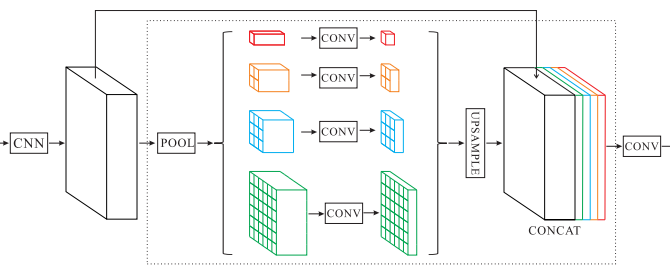

### Deep feature experiments and results


## Existing results

The result reported in respective papers for Caltech dataset 

| Approach |Caltech-101 |caltech 256|
|--|--|--|
|[FVCNN](https://www.robots.ox.ac.uk/~vedaldi/assets/pubs/cimpoi15deep.pdf)  | ? |?
[Deep-Ten](http://openaccess.thecvf.com/content_cvpr_2017/papers/Zhang_Deep_TEN_Texture_CVPR_2017_paper.pdf)|85.3|?
[E2E-SCN-SPP](https://link.springer.com/content/pdf/10.1007%2Fs11063-018-9967-5.pdf)|94.3|86.5
[ProCRC](http://azadproject.ir/wp-content/uploads/2014/07/2015-A-Probabilistic-Collaborative-Representation-based-Approach-for-Pattern-Classification.pdf)|94.8|86.1


### Result of FV-CNN reported in various paper


Paper|Caltech-101 |caltech 256|
|--|--|--|
[Deep-Ten](http://openaccess.thecvf.com/content_cvpr_2017/papers/Zhang_Deep_TEN_Texture_CVPR_2017_paper.pdf)|83.0|?|
[E2E-SCN-SPP](https://link.springer.com/content/pdf/10.1007%2Fs11063-018-9967-5.pdf)|90.3|81.2|
### Result of FV-CNN reported in our experiment
Experiment setup|Caltech-101|Caltech-256|
|--|--|--|
FV-CNN on VGG_VD|86.69|214673|
FV+FC-CNN on VGG_VD|92.34|?|

## Experiment 1
### General experimental setup
Input image size set to 224&times;224 for all experiment except FV-CNN and FV+FC-CNN.
The convolutional network for feature extraction are not trainable.

|Exp params|Value|
|--|--|
|Learning rate| 0.005
| train_batch_size | 16 |
|input_size|224&times;224|
|weight decay|0.0001|
|lr decay|0|
|momentum|0.9|


Experiment setup|Caltech-101|Caltech-256|
|--|--|--|
VGG-VD fineturn|[75.13](http://10.2.16.142/r1/ijdar/215776.html)|[65.27](http://10.2.16.142/r1/ijdar/216041.html)|
VGG-VD +[PPM](#ppm)|[81.02](http://10.2.16.142/r1/ijdar/216766.html)|[64.62](http://10.2.16.142/r1/ijdar/216686.html)|
VGG-VD +[SPP](#spp) |[81.23](http://10.2.16.142/r1/ijdar/217404.html)|[66.41](http://10.2.16.142/r1/ijdar/217405.html)|
VGG-VD +[PPM](#ppm)+[SPP](#spp)|[81.85](http://10.2.16.142/r1/ijdar/217402.html)|[62.89](http://10.2.16.142/r1/ijdar/217403.html)|
VGG-VD +[SCN](#scn)+[SPP](#spp)|?|?|
VGG-VD +[PPM](#ppm)+[SCN](#scn)+[SPP](#spp)|?|?|
Resnet 152 finetune|[86.5](http://10.2.16.142/r1/ijdar/215833.html)|[80.91](http://10.2.16.142/r1/ijdar/215918.html)|
Resnet 152 +[PPM](#ppm)|[88.32](http://10.2.16.142/r1/ijdar/217200.html)|[84.26](http://10.2.16.142/r1/ijdar/217573.html)|
Resnet 152 +[SPP](#spp)|[89.88](http://10.2.16.142/r1/ijdar/217174.html)|[81.26](http://10.2.16.142/r1/ijdar/217407.html)|
Resnet 152 +[PPM](#ppm)+[SPP](#spp)|[90.85](http://10.2.16.142/r1/ijdar/217263.html)|[79.91](http://10.2.16.142/r1/ijdar/217406.html)|
Resnet 152 +[SCN](#scn)+[SPP](#spp)|?|?|
Resnet 152 +[PPM](#ppm)+[SCN](#scn)+[SPP](#spp)|?|?|

___
#### SPP


*A network structure with a spatial pyramid
pooling layer (SPP). Here 512 for VGG and 2048 or resnet is the filter number of the last convolutional layer.* [Kaiming He 2015](https://arxiv.org/pdf/1406.4729.pdf)
___
#### PPM



*A pyramid parsing module (PPM) is applied to harvest different sub-region representations, followed by upsampling and concatenation layers to form the final feature representation, which carries both local and global context information* [Hengshuang Zhao 2017](https://arxiv.org/pdf/1612.01105.pdf)


___
#### SCN


*A sparse coding network (SCN) is applied to encode the deep convolutional features* [Boheng Chen 19](https://link.springer.com/content/pdf/10.1007%2Fs11063-018-9967-5.pdf)

```javascript
class _SparseCodingModule(nn.Module):
    def __init__(self,in_dim, code_len, no_iterations):
        super(_SparseCodingModule, self).__init__()
        self.w_d = nn.Sequential(nn.Conv2d(in_dim,code_len, kernel_size=1, bias=False),
                        nn.Dropout(0.5)
                         )   
        self.w_s1 = nn.Sequential(
                nn.ReLU(),
                nn.Conv2d(code_len, code_len, kernel_size=1, bias=False),
                nn.Dropout(0.5)
                        )   
        self.final_relu = nn.Sequential(nn.ReLU())
        self.w_s = []
        self.w_g = []
        for s in range(0,no_iterations-1):
            self.w_s.append(nn.Sequential(
                nn.ReLU(),
                nn.Conv2d(code_len, code_len, kernel_size=1, bias=False),
                nn.Dropout(0.5)
                ))  
            self.w_g.append(nn.Sequential(
                nn.ReLU(),
                nn.Conv2d(code_len, code_len, kernel_size=1, bias=False),
                nn.Dropout(0.5)
                ))  
        self.w_s = nn.ModuleList(self.w_s)
        self.w_g = nn.ModuleList(self.w_g)

    def forward(self, x): 
        x = self.w_d(x)
        inp_wg = x 
        inp_ws = x 
        out_ws = self.w_s1(inp_ws)
        out_wg = 0 
        for w_s, w_g in zip(self.w_s, self.w_g):
            inp_ws = out_ws+x+out_wg
            out_wg = w_g(inp_wg)
            inp_wg = inp_ws
            inp_ws = w_s(inp_ws)+x+out_wg
        return self.final_relu(inp_ws)           
```
